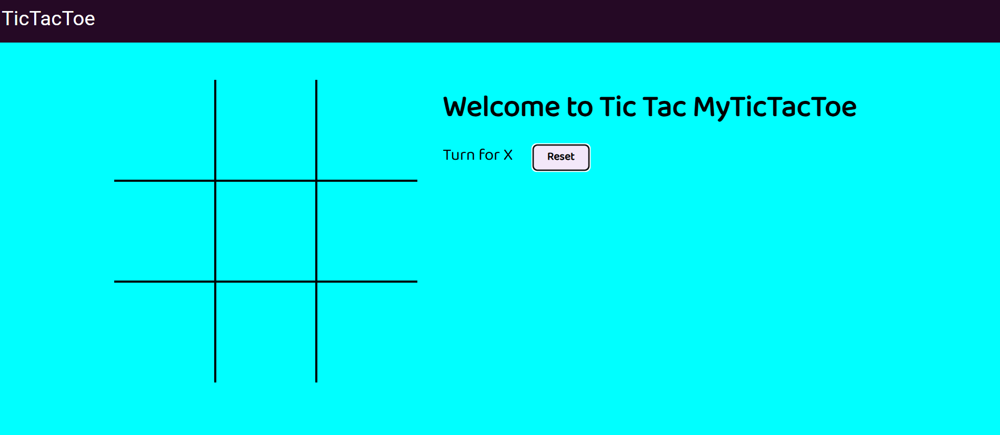
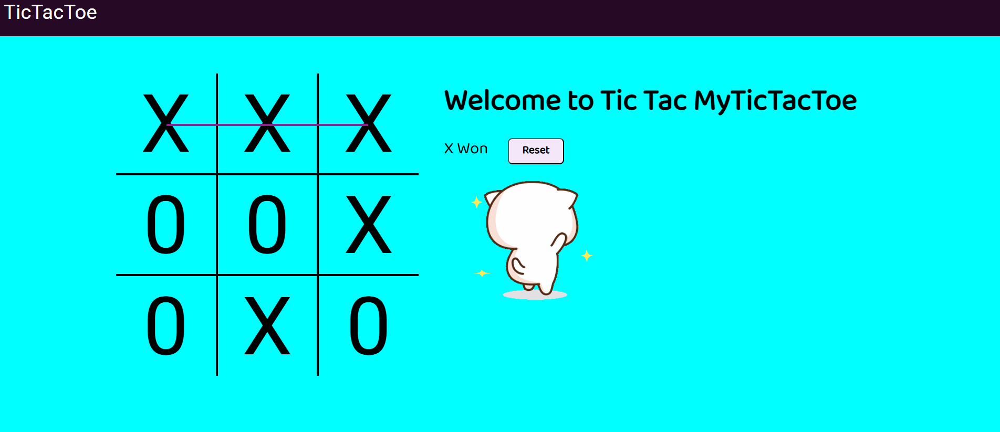
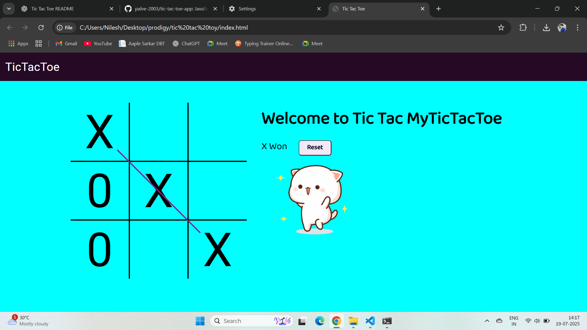

# 🎮 Tic Tac Toe App

A fun, interactive, and audio-enhanced Tic Tac Toe game built with HTML, CSS, and JavaScript. Challenge your friends or play solo on this responsive and engaging web app!


## 📁 Project Structure

```
📦 Tic Tac Toe App
├── index.html           # Main game UI
├── style.css            # Styling and layout
├── script.js            # Game logic
├── images/
│   ├── demo1.png        # Screenshot 1
│   ├── demo2.png        # Screenshot 2
│   └── demo3.png        # Screenshot 3
├── excited.gif          # Win animation
├── music.mp3            # Background music
├── ting.mp3             # Click sound
├── gameover.mp3         # Game over sound
└── README.md            # Project documentation
```

## 🚀 Features

- 🎲 Classic 2-player Tic Tac Toe game
- 🔊 Sound effects for moves, wins, and game over
- 🎵 Background music for immersive play
- 🎉 Excited GIF animation when a player wins
- 💻 Fully responsive layout

## 🖼️ Screenshots

Below are some previews of the game in action:

### 📌 Game Start Screen


### 🕹️ Gameplay in Progress


### 🏁 Game Over / Winner Screen


## 🛠️ Tech Stack

- **HTML5** – Structure
- **CSS3** – Styling and layout
- **JavaScript** – Logic and interactivity

## 📦 Installation & Usage

1. **Clone the repository:**
   ```bash
   git clone https://github.com/your-username/tic-tac-toe-app.git
   cd tic-tac-toe-app
   ```

2. **Open `index.html` in your browser** to start the game.

## 🔊 Media Assets

- `excited.gif` – Win celebration animation
- `ting.mp3` – Box click sound
- `gameover.mp3` – Game over sound
- `music.mp3` – Background music

## 📜 License

This project is licensed under the [MIT License](https://choosealicense.com/licenses/mit/).

---

> Developed by [Nilesh Palve](https://www.linkedin.com/in/nileshpalve/)
